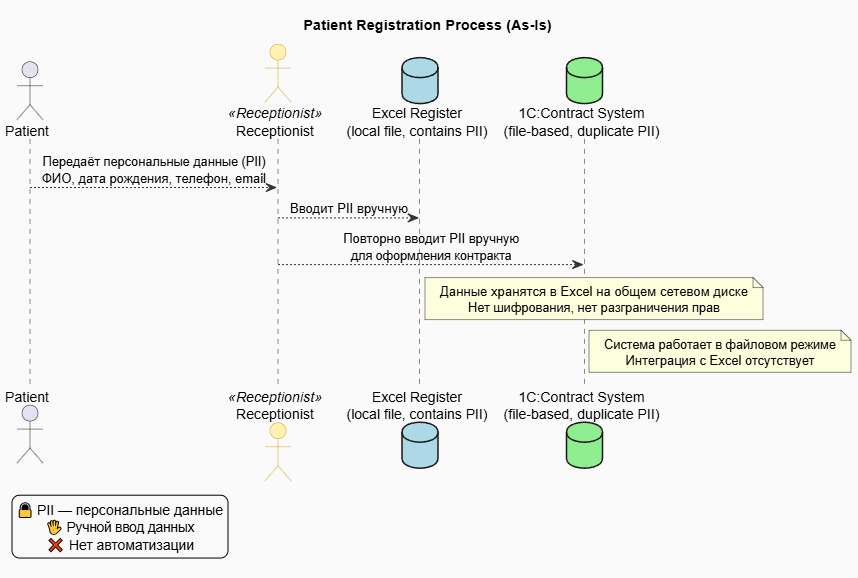
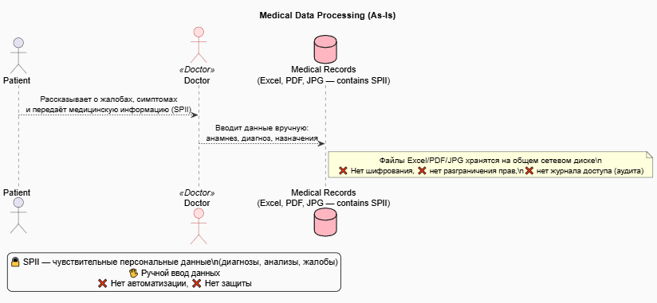
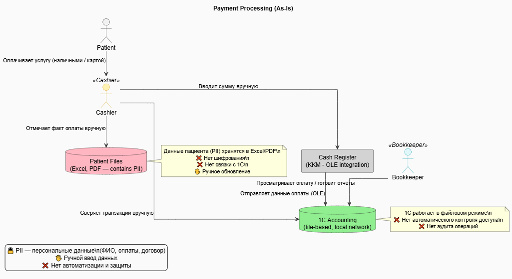
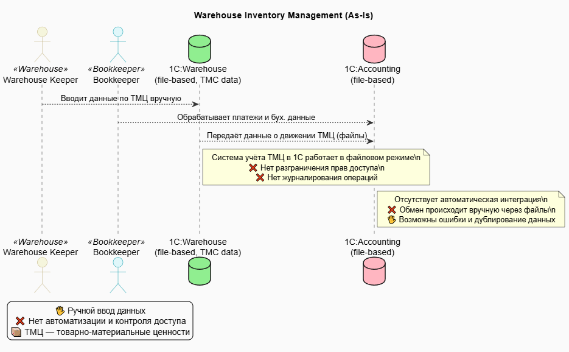
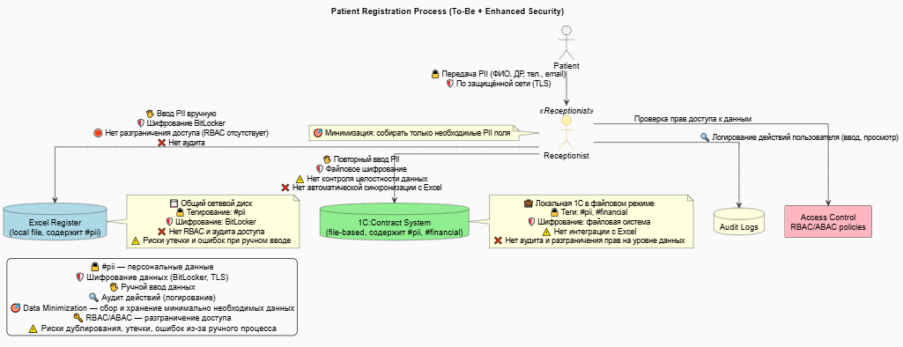
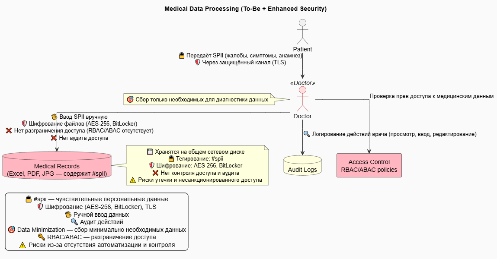
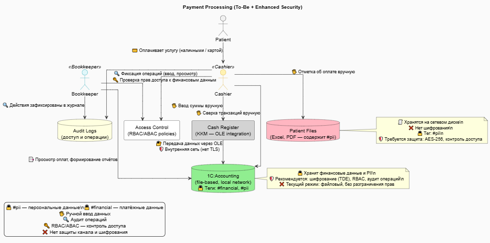
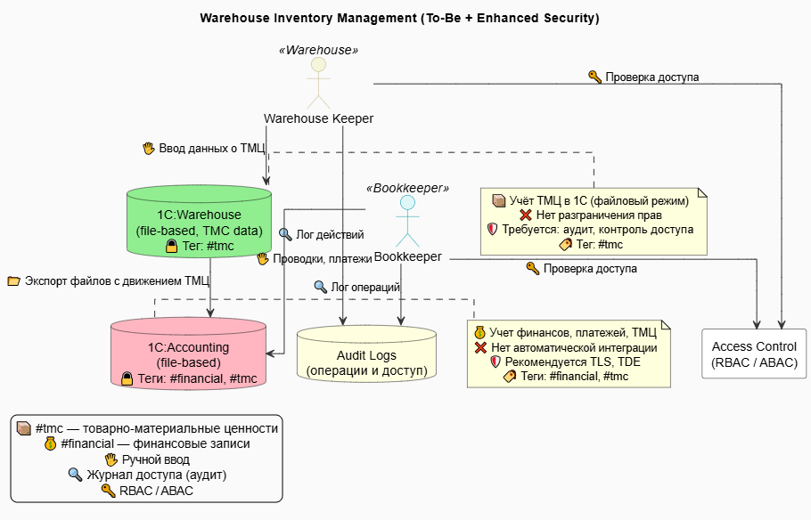

# 🔒 Задание 1. Анализ безопасности системы

## 📦 Потоки

### 📁 Диаграммы Data Flow

#### 🔍 As-Is (Текущее состояние)

- [📌 Запись пациента](./as-is/DFD_patient_registration_process.puml)  
  

- [📌 Обработка анализов пациента](./as-is/DFD_medical_data_processing.puml)  
  

- [📌 Обработка платежей](./as-is/DFD_payment.puml)  
  

- [📌 Учет ТМЦ](./as-is/DFD_warehouse_inventory_management.puml)  
  

---

#### 🚀 To-Be (Целевое состояние)

- [🔧 Запись пациента (To-Be)](./to-be/DFD_patient_registration_process_to_be.puml)  
  

- [🔧 Обработка анализов пациента (To-Be)](./to-be/DFD_medical_data_processing_to_be.puml)  
  

- [🔧 Обработка платежей (To-Be)](./to-be/DFD_payment_to_be.puml)  
  

- [🔧 Учет ТМЦ (To-Be)](./to-be/DFD_warehouse_inventory_management_to_be.puml)  
  

---

## 📋 Аудит мер по обеспечению безопасности данных

📄 [Открыть файл аудита](./data-security-audit.md)

---

## 🔐 Улучшения

### 🛡️ 1. Список данных, требующих защиты и способы защиты

| Категория данных                | Примеры                               | Уровень чувствительности | Тег          | Способ защиты             |
| ------------------------------- | ------------------------------------- | ------------------------ | ------------ | ------------------------- |
| 🔒 PII (персональные данные)    | ФИО, ДР, Email, телефон, адрес        | Высокий                  | `#pii`       | Шифрование, Обфускация    |
| 🔒 SPII (чувствительные данные) | Диагноз, анамнез, жалобы, назначения  | Критический              | `#sensitive` | Шифрование, Обезличивание |
| 📄 Финансовые данные            | Суммы платежей, ИНН, номер договора   | Средний                  | `#financial` | Шифрование                |
| 📊 Аналитические данные         | Статистика, история приёмов           | Средний                  | `#analytics` | Обезличивание             |
| 📎 Документы и сканы            | JPG, PDF, Excel с картами и анализами | Высокий                  | `#doc`       | Шифрование                |
| 🗂️ Идентификаторы пациентов     | ID, номер записи, номер контракта     | Средний                  | `#internal`  | Обфускация                |
| 🧪 Лабораторные данные          | Результаты анализов                   | Критический              | `#sensitive` | Шифрование, Обезличивание |

---

### 🏷️ 2. Механизм тегирования данных

📌 **Цель:** автоматическое определение уровня защиты и маршрутизация потоков доступа.

| Тег          | Назначение                               |
| ------------ | ---------------------------------------- |
| `#pii`       | Персональные данные                      |
| `#sensitive` | Чувствительные медицинские данные (SPII) |
| `#financial` | Финансовая информация                    |
| `#doc`       | Документы и сканы                        |
| `#internal`  | Идентификаторы и служебные данные        |
| `#analytics` | Необезличенные аналитические данные      |

💡 **Теги используются в:**

- 📄 Базах данных (PostgreSQL, ClickHouse) — на уровне колонок
- 📁 Файловой системе — через XMP/EXIF-метаданные
- 🌊 Data Lake — через Apache Atlas / Amundsen
- 🔄 ETL / ELT — в Airflow / NiFi через AutoTag-пайплайны

---

### 🛠️ 3. Инструменты и меры обеспечения конфиденциальности

#### 🔐 Криптографическая защита

| Инструмент | Назначение                                      |
| ---------- | ----------------------------------------------- |
| TLS 1.3    | Безопасная передача данных                      |
| AES-256    | Шифрование файлов и содержимого БД              |
| Vault      | Хранение ключей, обфускация, шаблоны            |
| GPG        | Защита документов при передаче по каналам связи |

#### 👤 Контроль доступа

| Средство    | Назначение                          |
| ----------- | ----------------------------------- |
| RBAC / ABAC | Контроль доступа по ролям/атрибутам |
| LDAP + AD   | Централизованная аутентификация     |
| 2FA         | Двухфакторная аутентификация        |

#### 🔍 Мониторинг и аудит

| Инструмент           | Назначение                        |
| -------------------- | --------------------------------- |
| Audit Logging        | Журналирование доступа и действий |
| Prometheus + Grafana | Мониторинг систем и алерты        |
| ELK Stack            | Анализ логов, расследования       |

#### 📦 Дополнительные меры

| Метод             | Описание                                      |
| ----------------- | --------------------------------------------- |
| Data Minimization | Сбор только необходимых данных                |
| Tokenization      | Замена чувствительных данных идентификаторами |
| Обезличивание     | Удаление PII перед аналитикой                 |
| Secure Data Lake  | Хранение данных с ролевым доступом в озере    |

---
