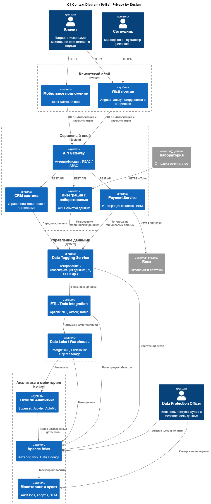

# 🔒 Задача 2. Проектирование решения

В задании требуется построить **C4 диаграмму контекста**, хотя по описанию и структуре системы больше подходит **диаграмма контейнеров**.

---

## 🏗️ Основные системы и компоненты

- **CRM, PaymentService, LabIntegration**  
  Источники данных с разной степенью чувствительности:

  - PII (персональные данные)
  - SPII (чувствительные медицинские данные)
  - Финансовые данные

- **Data Tagging Service**  
  Сервис для тегирования и классификации данных, обеспечивающий контроль и управление доступом.

- **Apache NiFi**  
  Обеспечивает очистку данных, фильтрацию, модификацию тегов и подготовку данных к дальнейшей обработке.

- **ETL-платформа (Airflow, Kafka)**  
  Управляет потоками данных, маршрутизирует и обрабатывает данные перед загрузкой в хранилище.

- **Data Lake + Apache Atlas**  
  Централизованное хранилище данных с управлением метаданными, тегами и возможностью отслеживания Data Lineage.

- **API Gateway с RBAC/ABAC**  
  Реализует строгий контроль доступа на основе ролей и атрибутов, обеспечивает безопасный доступ к данным.

- **Мониторинг и аудит**  
  Система для отслеживания доступа к данным, выявления аномалий и предупреждения о подозрительной активности.

---

## 📊 Диаграмма

[Диаграмма контекста (DFD_c4_context_to_be.puml)](DFD_c4_context_to_be.puml)

